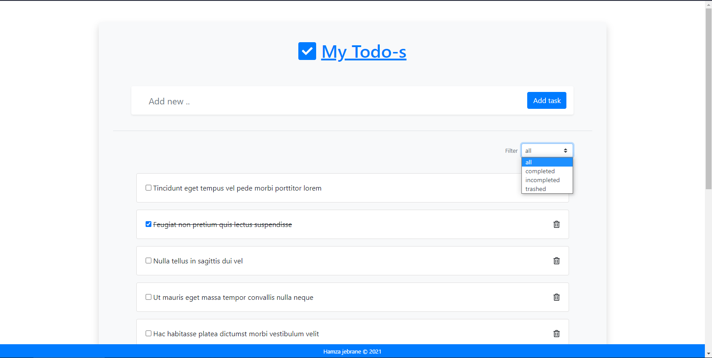
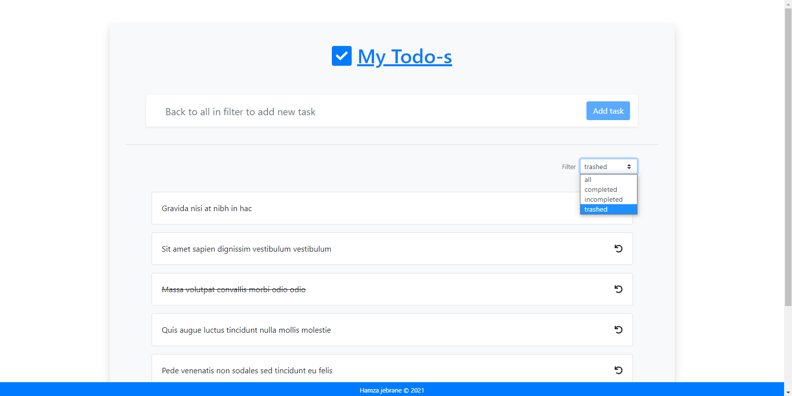

# MY TODOS
Todos project with Laravel + vue/vuex

## Usage

1 - Clone your project

2 - Go to the folder application using cd command on your cmd or terminal

3 - Run `composer install` on your cmd or terminal

#Demo pictuers

